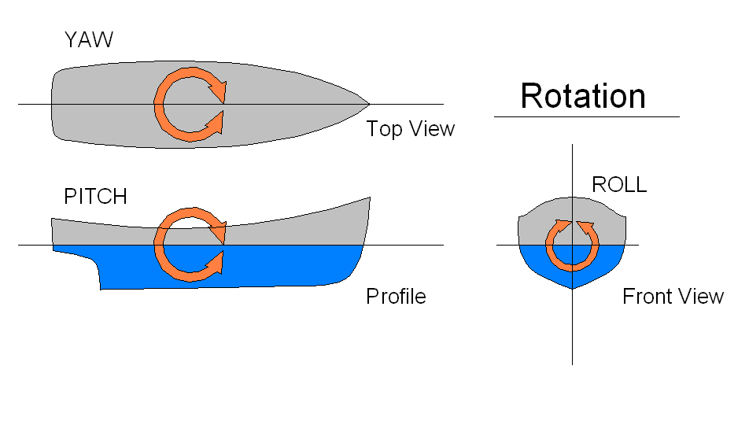
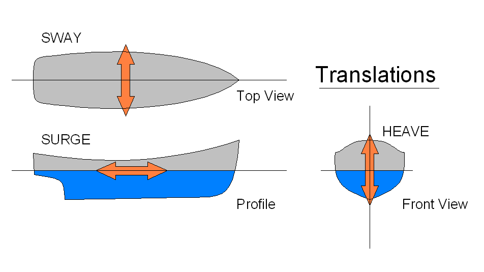

# Assignment

Use jupyter notebooks to investigate provided time series and present the vessel motion characteristics and possible correlations between the weather and the vessel motion.

## Time Series Description:

__Vessel Response:__

- `Heave` - The linear vertical (up/down) motion; excessive downward heave can swamp a ship.

- `Roll` - The tilting rotation of a vessel about its longitudinal/X (front-back or bow-stern) axis.

- `Pitch` - The up/down rotation of a vessel about its transverse/Y (side-to-side or port-starboard) axis. An offset or deviation from normal on this axis is referred to as trim or out of trim.

__Rotations:__



__Translations:__



[reference - The six types of motion on ships](https://www.youtube.com/watch?v=aK3G8n53D6A)

__Weather__

- `HS` - Hs total sea
- `HSS` - Hs swell
- `Hsw` - HS wind waves
- `Tp` - Tp Total Sea
- `Tps` - Tp swell
- `Tpw` - Tp wind waves
- `DIRM` - Wave direction total sea
- `DIRPs` - Wave direction swell
- `DIRPw` - Wave direction waves

# Directory structure

```
├── data  
│   └── assignment.docx  
|   └── complete_data_test.csv  
|   └── complete_data_train.csv  
|   └── complete_data_validation.csv  
|   └── vessel_response.csv  
|   └── vessel_response_agg_by_second.csv  
|   └── weather.csv  
|   └── weather_interpolated.csv  
├── references  
|   └── Cozad, Sahinidis, Miller - 2014 - Learning surrogate models for simulation-based optimization.pdf  
|   └── Gerenciamento Costeiro e Gerenciamento Portuário 2.pdf  
|   └── Prediction_of_vessel_propulsion_power_using_machin.pdf  
|   └── skandali2020.pdf  
|   └── wave_parameters.pdf  
├── src  
|   └── Rotations.png  
|   └── Translations.png  
├── 01 - Data pre-processing - vessel response.ipynb  
├── 02 - Data pre-processing - weather.ipynb  
├── 03 - Mount datasets.ipynb  
├── 04 - Heave Modeling.ipynb  
└── readme.ipynb  
```

# Notebooks  list:

## 01 - Data pre-processing - vessel response

Notebook responsible for pre processing vessel response data. 

__input file:__ `vessel_response.csv` - Original file.\
__output file:__ `vessel_response_agg_by_second.csv` - File with vessel response data grouped by second.

## 02 - Data pre-processing - weather

Notebook responsible for pre processing weather data.

__input file:__ `weather.csv`\
__output file:__ `weather_interpolated.csv`

## 03 - Mount datasets

Notebook responsible for synchonizing vessel response and weather data into unique dataset, separating it in three parts, `train`, `test` and `validation`.

__input files:__ 

- `vessel_response_agg_by_second.csv`
- `weather_interpolated.csv`

__output files:__

- `complete_data_train.csv`
- `complete_data_test.csv` 
- `complete_data_validation.csv`

## 04 - Heave Modeling

Notebook responsible for analysis, correlating heave movement with weather data.

# Improvement opportunity

1) Thank you!


2) Analysis about how to group vessel response. Is grouping by second good?


3) Consider linear interpolation for weather data is good? Can I use another kind of interpolation? Other frequency?


4) How to improve the oscillatory response?

    - Analyze how past data influences the current point.
    - Combine features using trigonometrical transformation. 
    
5) Hyperparameter tunning to improve the variability of the model making it reach greater amplitudes throughout the period of testing and validation.


6) Deeply understand the business.
